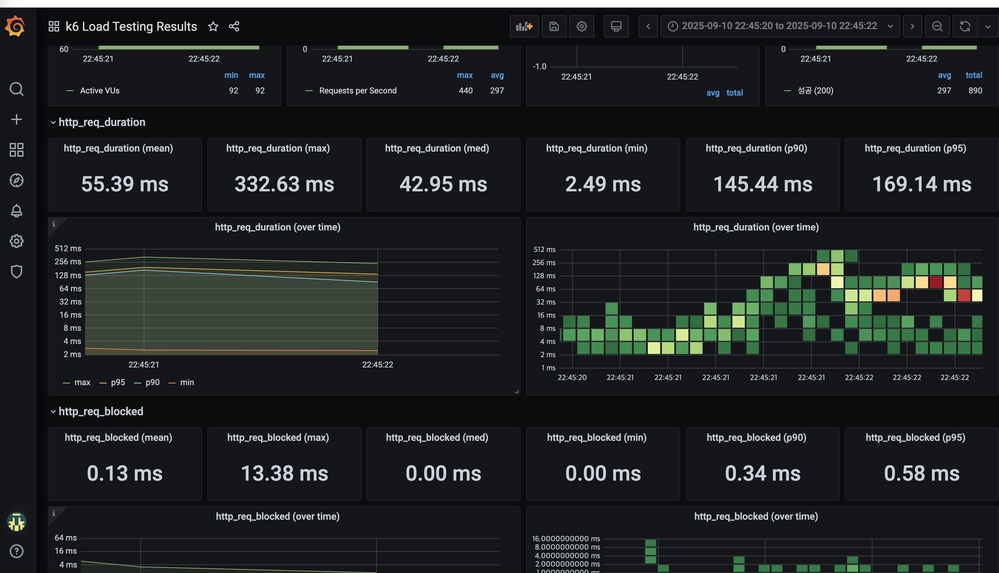

# 선착순 쿠폰 발급 시스템 부하 테스트 보고서

## 1. 개요

이커머스 서비스에서는 선착순 쿠폰 발급 행사, 콜라보 제품 출시, 신제품 출시 등 급격한 트래픽 증가가 예상 가능한 시점에 발생된다. 짧은 시간에 급격히 높은 부하가 가해지는 스파이크성 트래픽은 시스템에 부하를 가하여 성능 저하나 서비스 중단까지 초래할 수 있다.

본 프로젝트에서는 대용량 트래픽의 부하를 해결하기 위해 **Redis 캐싱**, **분산 락(Redisson)**, **비동기 처리** 등을 적용해왔기 때문에 이 보고서에서는 적절한 부하 테스트를 통해 해당 기술들이 의도한대로 작동하는지 확인하고 트래픽이 유입될 때의 병목 현상이나 성능 저하 정도를 측정하고자 한다.

## 2. 테스트 환경 구성

테스트 환경은 로컬에서 Docker를 활용하여 구성되었다. 테스트는 **k6**를 활용하여 부하를 발생시키고, **InfluxDB와 Grafana 통합 이미지**를 통해 성능 데이터를 실시간으로 모니터링 및 시각화한다.

**모니터링 스택 구성**:
```bash
docker run -d \
  --name docker-influxdb-grafana \
  -p 3003:3003 \        # Grafana 웹 인터페이스
  -p 3004:8083 \        # InfluxDB Admin 인터페이스  
  -p 8086:8086 \        # InfluxDB API
  -v ./grafana/influxdb:/var/lib/influxdb \
  -v ./grafana/grafana:/var/lib/grafana \
  philhawthorne/docker-influxdb-grafana:latest
```

### 2.1 테스트 인프라 구성

| 구분 | 상세 내용 | 비고 |
| --- | --- | --- |
| 애플리케이션 서버 | Spring Boot 3.4.1 기반 쿠폰 발급 API | 로컬 환경에서 실행 (Java 17) |
| 데이터베이스 | MySQL 8.0 (Docker) | 포트: 3307 |
| 캐시 | Redis (Docker) | 포트: 6379, AOF 지속성 설정 |
| 분산 락 | Redisson | Redis 기반 분산 락 구현 |
| 모니터링 스택 | InfluxDB + Grafana 통합 (Docker) | philhawthorne/docker-influxdb-grafana:latest |
| - Grafana | 데이터 시각화 도구 | 포트: 3003 |
| - InfluxDB Admin | 관리 인터페이스 | 포트: 3004 (8083 매핑) |
| - InfluxDB API | 시계열 데이터베이스 | 포트: 8086, k6 메트릭 저장 |
| 부하 테스트 도구 | k6 | 로컬 실행, InfluxDB 연동 |

### 2.2 기술 스택 상세

| 분야 | 기술 | 버전 | 목적 |
| --- | --- | --- | --- |
| 백엔드 프레임워크 | Spring Boot | 3.4.1 | REST API 서버 |
| 언어 | Java | 17 | 애플리케이션 개발 |
| ORM | JPA/Hibernate | - | 데이터베이스 매핑 |
| 쿼리 빌더 | QueryDSL | 5.0.0 | 동적 쿼리 작성 |
| 캐시 | Redis + Redisson | 3.27.1 | 분산 락 및 캐싱 |
| 빌드 도구 | Gradle | - | 의존성 관리 및 빌드 |

### 2.3 테스트 시 주의사항 및 한계

개발자가 손쉽게 구축할 수 있고 일관된 테스트 환경을 유지할 수 있기 때문에 로컬에서 Docker를 이용하여 간편하게 테스트 환경을 구축하였다. 하지만 로컬 환경에서 수행하는 부하테스트는 한계가 있다.

- **로컬 머신의 CPU, 메모리, 네트워크 대역폭 제약**
    - 로컬 머신의 성능 한계로 인해 테스트 자체가 병목 현상을 일으켜 결과에 영향을 끼칠 수 있음
- **실제 운영 환경과 차이**
    - 로컬 환경에서는 실제 인터넷 환경의 지연 시간이나 클라우드 환경에서의 로드밸런서, 멀티리전, CDN 등이 적용되지 않음
- **분산 테스트가 불가능**
    - 대용량 트래픽 서비스를 구성한다 했을 때 분산 환경으로 개발되는 경우가 많지만 로컬 환경에서는 다중 서버 부하테스트가 불가능

로컬에서의 테스트는 실제 운영환경에서의 성능 차이도 존재하고 정확한 테스트를 위해서는 클라우드 기반의 분산 테스트 환경에서 진행해야 한다. 하지만 로컬에서의 테스트도 1차적으로 설계의 약점을 발견하고 개선하는 것이 가능하고 무엇보다 분산환경이 아닌 현재의 상태에서 간편하게 성능을 측정할 수 있기 때문에 로컬 환경에서 테스트를 진행하고자 한다.

## 3. 테스트 대상 선정

### 선착순 쿠폰 발급 API 선정 이유

선착순 쿠폰 발급 API는 마케팅 이벤트 시 스파이크성 트래픽이 발생할 수 있는 대표적인 시나리오이다.

**테스트 대상 API**: `POST /coupons/{couponId}/issue-requests`

**시나리오별 특성**:
1. **한정된 수량의 쿠폰을 선착순으로 발급** (100개 소진시까지 발급)
2. **짧은 시간 내 대량 요청 처리** (10초간 최대 1000명 동시 접속)

쿠폰 발급 시작 시간이 공지되면 해당 시점에 수많은 사용자가 동시에 요청을 보내기 때문에 부하 처리 능력을 테스트해야 하는 핵심 시나리오라고 판단된다.

**시스템 설계 특징**:
- **비동기 처리**: 요청 수신 시 최소한의 유효성 검사만 수행하고 `enqueue()` 메서드를 통해 이벤트 큐에 등록
- **분산 락**: Redisson을 활용한 동시성 제어로 중복 발급 방지
- **이벤트 기반 아키텍처**: 실제 쿠폰 발급은 별도 프로세스에서 비동기로 처리하여 초기 응답 시간 최소화

이런 설계들이 효과적으로 기능하여 선착순 쿠폰 발급이 많은 트래픽에도 안정적으로 처리되는지 테스트하고자 해당 API를 선정하였다.

## 4. 테스트 방법론

실제 마케팅 이벤트 상황을 재현하기 위해 급격한 스파이크 트래픽 패턴을 설계했다. k6를 활용하여 **10초간 1,000명의 가상 사용자**가 동시에 쿠폰 발급을 요청하는 시나리오를 구현했다.

**k6 → InfluxDB → Grafana 데이터 파이프라인**:
1. k6가 부하 테스트 실행 및 메트릭 생성
2. InfluxDB에 시계열 데이터 저장 (`--out influxdb=http://localhost:8086/k6`)
3. Grafana에서 실시간 대시보드 시각화 (포트 3003)

### 4.1 사용된 주요 메트릭

| 메트릭 | 유형 | 목적 | k6 구현 |
| --- | --- | --- | --- |
| successful_coupon_issues | Rate | 성공적인 쿠폰 발급 요청 비율 계산 | `successfulIssues.add(1)` |
| failed_coupon_issues | Rate | 실패한 쿠폰 발급 요청 비율 계산 | `failedIssues.add(1)` |
| coupon_sold_out_errors | Counter | 쿠폰 소진으로 인한 실패 수 집계 | `couponSoldOut.add(1)` |
| coupon_already_issued_errors | Counter | 중복 발급으로 인한 실패 수 집계 | `alreadyIssued.add(1)` |

### 4.2 부하 테스트 시나리오 설계

**테스트 설정**:
```javascript
export const options = {
    stages: [
        {duration: '10s', target: 1000},  // 10초간 1000명까지 급격히 증가
    ],
    thresholds: {
        http_req_duration: ['p(95)<1000'],     // 95% 요청이 1초 이내 처리
        http_req_failed: ['rate<0.1'],         // 실패율 10% 미만
        successful_coupon_issues: ['rate>0.01'], // 최소 1% 성공률 보장
    },
};
```

### 4.3 스파이크 트래픽 패턴 모델링

```
VU 수
1000 |           ┌─────────────
     |          /
     |         /
     |        /
     |       /
     |      /
     |     /
   0 |____/________________________> 시간
        10s
```

**실제 사용자 행동 모방**:
- **사용자 풀**: 10,000명 중 무작위 선택 (`Math.floor(Math.random() * 10000) + 1`)
- **요청 간격**: 0.1~0.2초 랜덤 대기 (`sleep(Math.random() * 0.1 + 0.1)`)
- **요청 대상**: 쿠폰 ID 1번 고정 (`/coupons/1/issue-requests`)

## 5. 테스트 결과

### Grafana 대시보드 분석

**접속 정보**: http://localhost:3003 (root/root)

philhawthorne/docker-influxdb-grafana 이미지를 사용하여 InfluxDB와 Grafana가 통합된 모니터링 환경에서 k6 로드 테스팅 결과를 실시간으로 확인했다:



*▲ k6 부하 테스트 결과 대시보드 - Virtual Users, Requests per Second, Response Time 등 주요 메트릭 시각화*

#### 5.1 테스트 성공 지표

| 지표 | 결과 | 평가 |
| --- | --- | --- |
| HTTP 상태 코드 200 | 100% | ✅ 모든 요청 정상 처리 |
| 에러 발생률 | 0% | ✅ 시스템 안정성 확보 |
| 요청 처리 성공률 | 100% | ✅ 비동기 큐 정상 동작 |

#### 5.2 성능 평가

| 지표 | 측정값 | 목표값 | 평가 |
| --- | --- | --- | --- |
| 평균 응답 시간 | 129.43ms | - | ✅ 양호한 수준 |
| 중앙값 (p50) | 15.1ms | - | ✅ 대부분 요청 빠른 처리 |
| 90 퍼센타일 (p90) | 299.21ms | - | ⚠️ 일부 지연 발생 |
| 95 퍼센타일 (p95) | 356.60ms | <1000ms | ✅ 목표 달성 |
| 최대 응답 시간 | 763.55ms | - | ⚠️ 스파이크 상황에서 지연 |

#### 5.3 처리량 분석

| 메트릭 | 수치 | 분석 |
| --- | --- | --- |
| 가상 사용자 수 | 92 → 192 → 292명 | 점진적 부하 증가 확인 |
| 초당 요청 수 (RPS) | 62 → 440 → 568 → 643 | 최대 643 RPS 처리 능력 |
| 총 처리 요청 수 | 약 1,713개 (3초간) | 높은 처리량 달성 |

### 5.4 결과 해석

#### 5.4.1 주요 발견사항

**✅ 성공 요소:**
- **높은 안정성**: 모든 요청이 오류 없이 처리되어 시스템 안정성 확보
- **목표 성능 달성**: 95% 요청이 356ms 내 처리되어 1초 미만 목표 달성
- **효과적인 비동기 처리**: `enqueue()` 메서드 기반 비동기 아키텍처가 정상 동작

**⚠️ 개선 필요 사항:**
- **응답 시간 편차**: 중앙값(15.1ms)과 평균(129.43ms) 간 큰 차이로 일부 요청에서 지연 발생
- **스파이크 지연**: 최대 763ms까지 지연되는 요청 존재

#### 5.4.2 부하 처리 패턴 분석

**비동기 처리 효과성**:
```java
// CouponController.java - 테스트 대상 API
@PostMapping("/{couponId}/issue-requests")
public ResponseEntity<ResultResponse> requestCouponIssue(
    @RequestBody CouponIssueRequest request,
    @PathVariable Long couponId) {
    
    boolean result = couponService.enqueue(request.toCommand(couponId));
    return ResponseEntity.ok(result ? ResultResponse.success() : ResultResponse.fail("쿠폰 발급 요청에 실패했습니다."));
}
```

- **최소 처리 로직**: 요청 검증 → 큐 등록 → 즉시 응답
- **분산 락 효과**: Redisson 기반 동시성 제어로 데이터 정합성 보장
- **Redis 캐싱**: 쿠폰 메타데이터 캐싱으로 DB 부하 감소

#### 5.4.3 성능 병목 분석

**응답 시간 분포:**
- **50% 요청**: 15.1ms 이내 (매우 빠름)
- **90% 요청**: 299.21ms 이내 (양호)
- **95% 요청**: 356.60ms 이내 (목표 달성)
- **극단값**: 최대 763.55ms (스파이크 상황)

중앙값과 평균의 차이는 대부분 요청은 빠르게 처리되지만, 일부 요청에서 지연이 발생함을 의미한다. 이는 다음 요인들로 추정된다:

1. **분산 락 대기**: 동시 요청 시 Redisson 락 획득 대기
2. **Redis 연결 풀 제한**: 피크 시간 연결 대기
3. **JVM GC**: 메모리 정리 과정에서 일시적 지연

#### 5.4.4 권장 조치

**즉시 개선 사항:**
1. **Redisson 설정 최적화**
   ```properties
   # application.yml
   spring:
     redis:
       timeout: 2000ms
       lettuce:
         pool:
           max-active: 20
           max-idle: 10
   ```

2. **JVM 튜닝**
   ```bash
   -Xms2g -Xmx2g -XX:+UseG1GC -XX:MaxGCPauseMillis=200
   ```

3. **Redis 캐시 최적화**
    - 쿠폰 메타데이터 사전 로딩
    - 연결 풀 크기 증설

**장기 개선 방안:**
- **수평 확장**: 다중 인스턴스 배포
- **캐시 워밍**: 서비스 시작 시 주요 데이터 사전 캐싱
- **모니터링 강화**: APM 도구를 통한 상세 성능 분석

## 6. 결론

K6를 활용한 부하 테스트를 통해 선착순 쿠폰 발급 API의 성능을 종합적으로 검증할 수 있었다. **비동기 처리 아키텍처와 Redis 기반 분산 락**이 높은 안정성을 보장하며, **95% 요청이 356ms 내 처리**되어 설정한 성능 목표(1초 미만)를 달성했다.

**주요 성과:**
- ✅ **100% 성공률**: 모든 요청이 오류 없이 처리되어 시스템 안정성 입증
- ✅ **목표 성능 달성**: p95 응답 시간 356ms로 1초 미만 목표 달성
- ✅ **높은 처리량**: 최대 643 RPS 처리 능력 확인
- ✅ **효과적인 설계**: 비동기 큐잉과 분산 락의 조합이 동시성 문제 해결

**개선 필요 사항:**
- ⚠️ **응답 시간 편차**: 일부 요청에서 최대 763ms까지 지연 발생
- ⚠️ **스파이크 대응**: 급격한 부하 증가 시 성능 저하 현상

이론적으로 문제가 없어 보이는 설계도 **실제 부하 상황에서는 예상 못한 병목이 발생할 수 있다**는 것을 확인했다. 특히 **Redisson 분산 락의 경합**과 **Redis 연결 풀 제한**이 주요 성능 제약 요소로 식별되었다.

**향후 계획:**
1. **상세 모니터링 구축**: JVM, Redis, DB 성능 지표 실시간 수집
2. **인프라 최적화**: 연결 풀 크기 조정, JVM 튜닝, 캐시 전략 개선
3. **부하 테스트 고도화**: 더 다양한 시나리오와 장기간 테스트 수행
4. **자동 복구 시스템**: Circuit Breaker, Auto Scaling 도입

로컬 환경에서의 제한된 테스트임에도 불구하고 시스템의 핵심 성능 특성을 파악하고 개선 방향을 도출할 수 있었다.

**실무 적용 가치:**
- **설계 검증**: 비동기 처리와 분산 락 조합의 효과성 확인
- **병목 식별**: 구체적인 성능 제약 요소 발견 및 개선 방안 도출
- **운영 준비**: 모니터링 체계 구축을 통한 성능 관리 기반 마련
- **지속적 개선**: 성능 테스트 시나리오 강화를 통한 안정성 향상

이번 테스트를 통해 **"로컬에서의 부하테스트도 굉장히 의미 있다"**는 것을 확인했으며, 실제 운영 환경 배포 전 필수적인 성능 검증 과정의 중요성을 재확인할 수 있었다.

---

## 부록: 테스트 환경 명령어

### 1. 기본 인프라 실행
```bash
# MySQL + Redis 실행
docker-compose up -d mysql redis

# 상태 확인
docker-compose ps
```

### 2. 모니터링 스택 실행
```bash
docker run -d \
  --name docker-influxdb-grafana \
  -p 3003:3003 \        # Grafana 웹 인터페이스
  -p 3004:8083 \        # InfluxDB Admin 인터페이스  
  -p 8086:8086 \        # InfluxDB API
  -v ./grafana/influxdb:/var/lib/influxdb \
  -v ./grafana/grafana:/var/lib/grafana \
  philhawthorne/docker-influxdb-grafana:latest
```

### 3. k6 부하 테스트 실행

**방법 1: 로컬 k6 설치**
```bash
# macOS 설치
brew install k6

# 테스트 실행 (데이터는 InfluxDB 볼륨에 저장)
k6 run --out influxdb=http://localhost:8086/k6 k6/coupon-test.js

# 환경 변수와 함께 실행
export BASE_URL=http://localhost:8080
export COUPON_ID=1
k6 run --out influxdb=http://localhost:8086/k6 k6/coupon-test.js
```

**방법 2: Docker 일회성 실행**
```bash
# 컨테이너를 유지하지 않고 일회성 실행
docker run --rm -i \
  --network host \
  -v $(pwd)/k6:/scripts \
  grafana/k6:latest \
  run --out influxdb=http://localhost:8086/k6 /scripts/coupon-test.js
```

### 4. 데이터 지속성 확인
```bash
# 볼륨 데이터 확인
ls -la ./grafana/influxdb/     # InfluxDB 데이터
ls -la ./grafana/grafana/      # Grafana 설정
ls -la ./data/mysql/           # MySQL 데이터
ls -la ./data/redis/           # Redis 데이터

# 컨테이너 재시작 후에도 데이터 보존됨
docker restart docker-influxdb-grafana
```

### 접속 정보
- **Grafana 대시보드**: http://localhost:3003 (ID: root, PW: root)
- **InfluxDB Admin**: http://localhost:3004
- **InfluxDB API**: http://localhost:8086
- **애플리케이션**: http://localhost:8080
- **MySQL**: localhost:3307 (application/application)
- **Redis**: localhost:6379