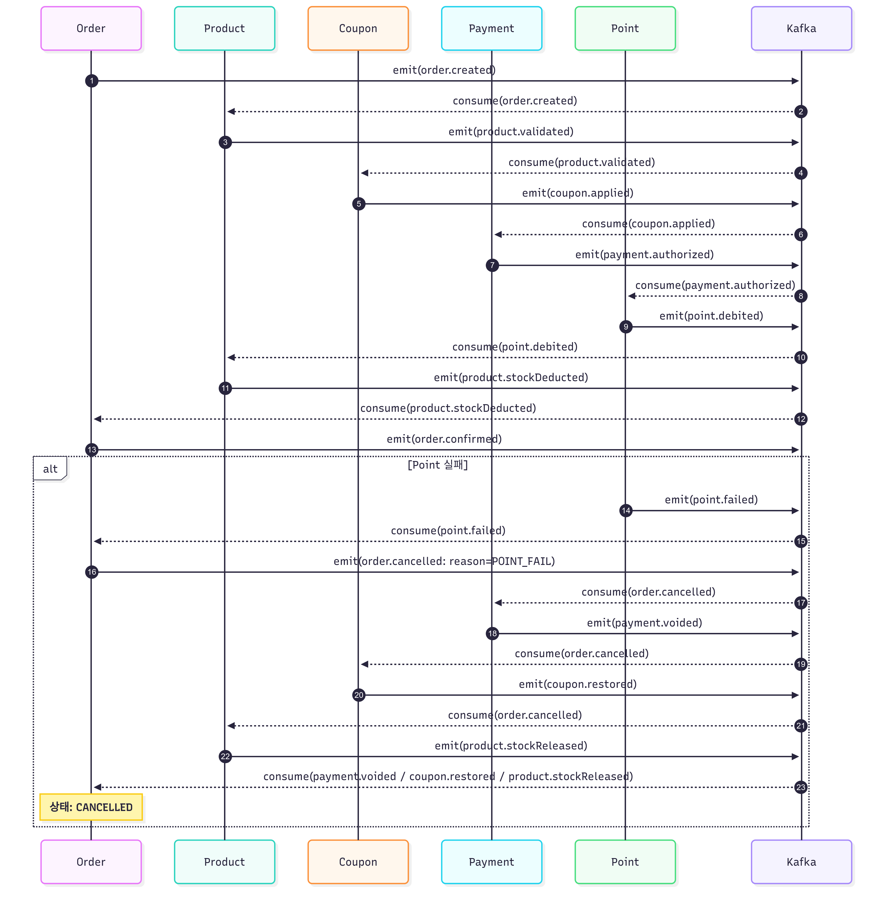

## 1. MSA 전환 이유

서비스 수요 증가와 트래픽 확산으로 인해, 단일 애플리케이션 구조는 성능 저하, 배포 복잡성, 장애 확산 등의 한계를 드러내고 있습니다.
도메인의 복잡성 증가와 서버 자원 부담, 트랜잭션 관리 어려움도 함께 가중되고 있습니다.

현재 시스템은 주문, 결제, 포인트, 쿠폰 등 다양한 도메인이 하나의 애플리케이션과 데이터베이스에 통합되어 있어 도메인 간 영향이 크고, 요청 부하나 운영 전략의 차이를 유연하게 대응하기 어렵습니다.

이에 따라 도메인 단위의 서비스 및 데이터베이스 분리를 통해 독립적 확장, 배포, 장애 격리가 가능한 마이크로서비스 아키텍처(MSA)로의 전환이 필요합니다.

---

## 2. 도메인 분리 기준

MSA 구조로 전환하기 위해서는 비즈니스 중심의 명확한 **도메인 경계(Bounded Context)**를 정의해야 합니다.
본 시스템에서는 다음과 같은 기준으로 도메인을 분리합니다.

### ✅ 도메인 구분 기준

| 도메인         | 주요 책임                        | 데이터 저장소    |
| ----------- | ---------------------------- | ---------- |
| **Order**   | 주문 생성, 상태 관리, 이벤트 발행 및 최종 확정 | order DB   |
| **Product** | 상품 유효성 검증, 재고 차감 및 복원        | product DB |
| **Coupon**  | 쿠폰 정책 조회, 적용, 복구 처리          | coupon DB  |
| **Payment** | 결제 승인, 취소 및 결제 상태 관리         | payment DB |
| **Point**   | 포인트 차감, 복구 및 잔액 검증           | point DB   |

---

### ✅ 서비스 분리 기준 및 도메인 경계 설계 원칙

서비스를 MSA(Microservice Architecture)로 전환함에 있어, 다음과 같은 기준에 따라 도메인 및 서비스 경계를 정의하였습니다.

* 서비스 간 통신은 **도메인 이벤트 기반 비동기 메시지**를 활용합니다.
* 데이터 일관성은 **최종 일관성(Eventual Consistency)** 원칙에 따라 설계됩니다.
* 각 도메인은 **독립된 트랜잭션 처리 범위**를 가지며, 외부와는 느슨한 결합을 유지합니다.

#### 2-1. 비즈니스 도메인 중심 분리

* 각 서비스는 \*\*핵심 비즈니스 영역(도메인)\*\*에 따라 분리됩니다.
  예: 사용자(User), 상품(Product), 주문(Order), 결제(Payment) 등
* 각 도메인은 \*\*고유한 책임(Aggregate Root)\*\*을 가지며, 해당 비즈니스 로직을 자체적으로 처리합니다.

#### 2-2. 기능적 독립성

* 서비스는 **기능 단위로 독립적 실행 및 배포**가 가능하도록 설계됩니다.
* 이를 통해 서비스 간 **의존도를 최소화**하고, **유연한 운영과 확장**이 가능해집니다.

#### 2-3. 데이터 독립성

* 각 도메인은 **자체 데이터베이스를 보유**하며, 데이터 저장/조회/갱신을 자체적으로 수행합니다.
* 도메인 간 **데이터 직접 접근은 금지**하고, **이벤트 기반 메시징**으로 간접 연동합니다.

#### 2-4. Bounded Context 기반 설계

* 각 도메인은 **Bounded Context**로 정의되며,
  도메인 내부 용어 및 개념은 외부와 명확히 구분되어 설계됩니다.
* 이를 통해 도메인 간 **개념 충돌을 방지**하고, **명확한 책임 경계**를 유지할 수 있습니다.

---

## 3. Choreography 선택 이유 및 설계

### ✅ 선택한 아키텍처: **Choreography 기반 이벤트 흐름**

* 주문(Order) → 상품(Product) → 쿠폰(Coupon) → 결제(Payment) → 포인트(Point)의 **비즈니스 흐름을 이벤트로 연결**합니다.
* **중앙 오케스트레이터 없이** 각 서비스가 Kafka 이벤트를 **자율적으로 발행 및 구독**힙니다.
* 도메인 간 의존도를 줄이고, 확장성과 유연성을 확보할 수 있는 구조입니다.

---

### ✅ Choreography 선택 이유 요약

| 항목                | 설명                                      |
| ----------------- | --------------------------------------- |
| **서비스 간 결합도 최소화** | 각 도메인은 Kafka 이벤트만으로 느슨하게 연결됨            |
| **확장성**           | 새 서비스 추가 시 기존 코드 수정 없이 이벤트만 구독하면 됨      |
| **단일 장애 지점 제거**   | 중앙 컨트롤러가 없으므로, 한 서비스 실패가 전체 장애로 이어지지 않음 |
| **책임 분리 명확**      | 각 도메인이 자체적으로 이벤트를 처리하고 책임을 가짐           |
| **도메인 흐름에 적합**    | 실세계 흐름(주문 → 결제 → 포인트 차감 등)과 잘 맞음        |

---

### ⚠️ Choreography 단점과 대응 전략

| 단점            | 설명              | 대응 전략                           |
| ------------- | --------------- | ------------------------------- |
| 흐름 파악 어려움     | 이벤트 흐름이 분산되어 있음 | → 시퀀스 다이어그램 + 이벤트명 표준화          |
| 디버깅 어려움       | 실패 위치 파악 어려움    | → Kafka 로그 + Trace ID + 분산 트레이싱 |
| 순환 참조 위험      | 이벤트 무한 순환 가능    | → 종단 이벤트 설정 + 단방향 설계            |
| 테스트 복잡성       | 통합 테스트가 필수      | → Kafka Stub + E2E 테스트 구성       |
| 멱등성 요구        | 이벤트 중복 처리 방지 필요 | → 이벤트 ID 체크 or Redis 활용         |
| 보상 트랜잭션 설계 부담 | 각 도메인에 보상 로직 필요 | → 보상 이벤트 체계 정의 및 흐름 문서화         |

---

### ✅ 멱등성과 트랜잭션 보장 전략

| 전략                          | 설명                                     |
| --------------------------- | -------------------------------------- |
| **Outbox Pattern**          | DB 트랜잭션과 Kafka 발행을 분리하여 안정성 확보         |
| **Inbox Pattern**           | 수신 서비스에서 이벤트 중복 소비 방지                  |
| **분산 락 (@DistributedLock)** | 상품, 쿠폰 도메인에 각각 락으로 이중 주문 방지              |
| **보상 이벤트 흐름 설계**            | 예: `order.cancelled` 발생 시 각 도메인이 보상 실행 |

---

## 4. 시퀀스 다이어그램 
### 4-1. 전체 시퀀스 다이어그램 

#### 4-1-1. 개요

- 본 시스템은 Kafka 기반 Choreography 패턴을 적용하여 주문 흐름을 이벤트 중심으로 설계하였습니다.
- 각 도메인은 독립적인 트랜잭션과 Outbox 패턴을 기반으로 상태를 변경하며, 이벤트 발행을 통해 다음 도메인을 비동기적으로 호출합니다.
- 주문 및 재고와 같이 중복이나 동시성이 민감한 도메인에는 Redisson 기반의 분산 락을 적용하여 일관성을 보장하며,
- 포인트 차감 실패와 같은 예외 상황에는 **보상 트랜잭션(Compensating Transaction)**을 통해 데이터 정합성을 회복합니다.

### 4-2. 멱등성 처리 시퀀스 다이어그램 (주문)

#### 4-2-1. 개요

- 주문 생성 후 `order.created` 이벤트가 Kafka로 발행됨
- 상품 서비스(Product)는 이를 구독하여 상품 유효성 검증 수행
- 이 과정에서 Kafka의 at-least-once 특성으로 인해 **중복 이벤트 수신**이 가능하므로, 이를 방어하는 **멱등 처리**가 필요

#### 4-2-2. 멱등 처리 목적

- Kafka 메시지가 중복 수신되더라도 **한 번만 비즈니스 로직이 실행**되어야 함
- 특히 재고 차감, 결제 승인, 포인트 차감 등의 **상태 변경 작업은 중복되면 안 됨**
  

---

